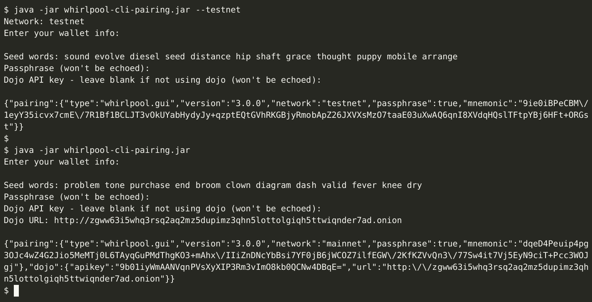

# whirlpool-cli-pairing

Generate the [Whirlpool](https://code.samourai.io/whirlpool/Whirlpool) pairing code without the Samourai Wallet app.



## Usage

```
$ java -jar whirlpool-cli-pairing.jar
```

For testnet, append `-t` or `--testnet`.

After generation, input the code in [whirlpool-gui](https://code.samourai.io/whirlpool/whirlpool-gui) or [whirlpool-client-cli](https://code.samourai.io/whirlpool/whirlpool-client-cli) to start mixing.

If using your own Dojo (recommended), refer to the [RoninDojo Wiki](https://wiki.ronindojo.io/en/setup/whirlpool) for instructions.

## Compiling

Maven 3+ and JDK 11+ are required. First, clone the project and cd to it:

```
git clone https://github.com/ottosch/whirlpool-cli-pairing
```

Then download dependencies and compile it with maven:

```
mvn clean compile assembly:single
```

The jar file will be located in `target` directory.
